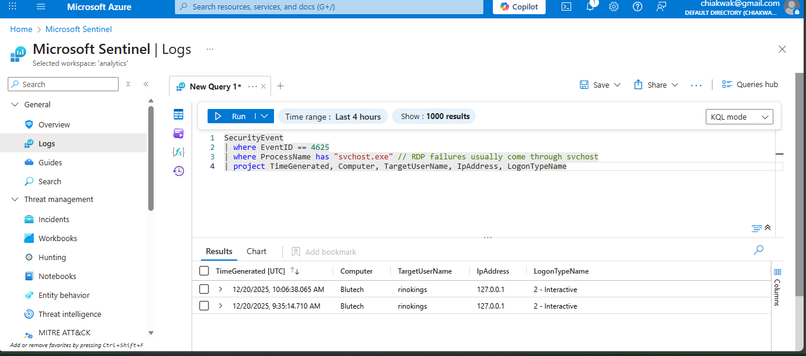

# Triage Report: RDP Brute Force Detection

## 🛡️ Scenario Overview
Simulated an external brute force attack originating from a Kali Linux VM targeting a Windows 10 victim. I used the password within the kali default unix_password.txt to perform a bruteforce attack. Using Hydra, the first 4 password combinations were forced within milliseconds, however RDP connection later failed.

## 🔍 Investigation Steps (Phase 1)
1. **Source:** Kali Linux (IP: 192.168.x.x) using **Hydra**.
2. **Detection:** Monitored `SecurityEvent` table for **Event ID 4625**.
3. **Analysis:** Identified failed logins within 2 minutes coming from an IP 127.0.0.1

![Victim Host IP]

(windows-vm-ip.png)


## 💻 KQL Query Used
```kusto
SecurityEvent
| where EventID == 4625
| where ProcessName has "svchost.exe"
| project Timegenerated, Computer, TargetUsername, IPAddress, LogonTypeName
```




## Mitigation Steps
Ensured to block RDP's default port 3389. Using "Windows Defender Firewall with Advanced Security" to disable inbound rules such as Remote Desktop (TCP-In) or Remote Desktop - User Mode (UDP-In). 
